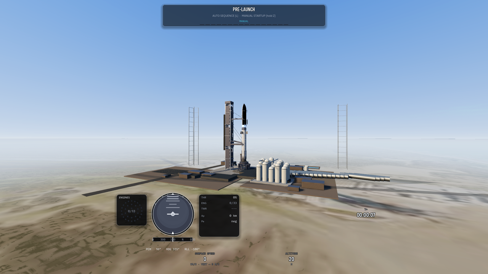
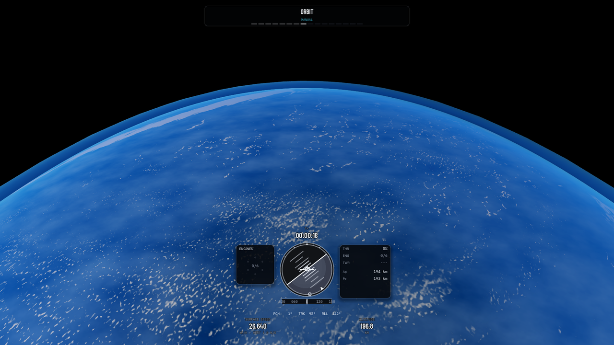
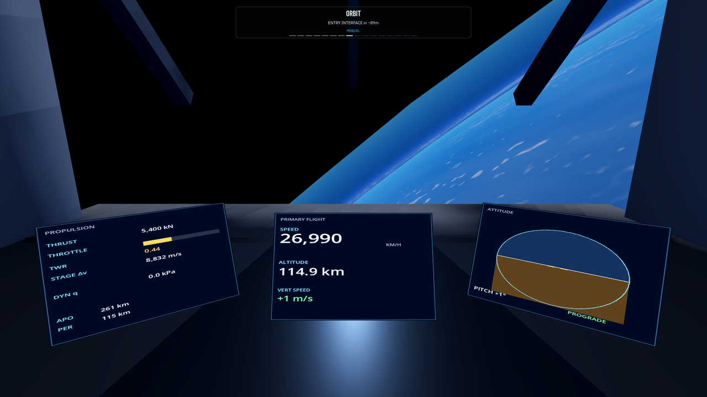
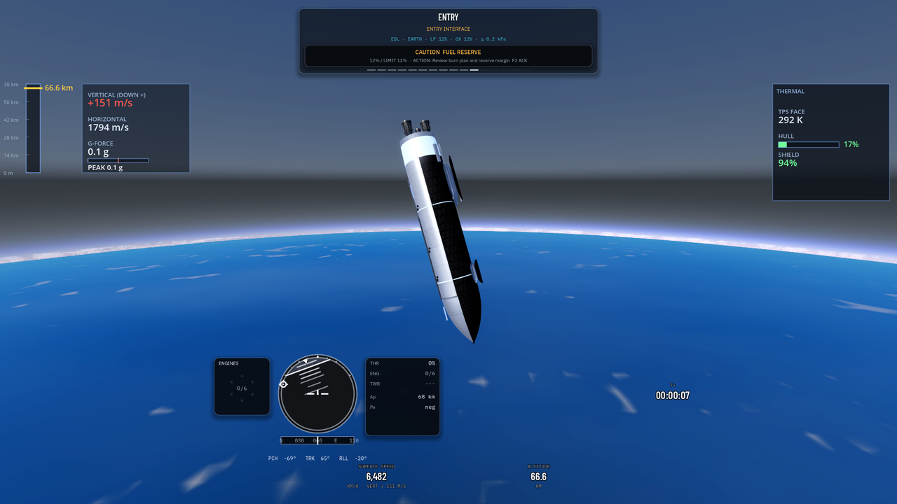

# Exosphere

Exosphere is a space-mission simulator. You fly a launch vehicle from the pad, through ascent, orbit, and reentry, in a double-precision model of the solar system. Free flight, the historical campaign, and the vehicle assembly building all use that same physics.

There is no installer yet. You play by opening the source in the Godot .NET editor.

## Screenshots

*Starship on the Starbase pad before launch.*

*Earth limb from low orbit, with the flight HUD.*

*Cockpit view over the day side as entry interface approaches.*

*Starship at entry interface, about 67 km, nose toward Earth.*

## Play

| Need | Version |
|------|---------|
| Godot with .NET support | 4.6.3 |
| .NET SDK | 8 |

The standard Godot build, without .NET, cannot open this project.

1. Clone the repository.
2. Open this folder in Godot 4.6.3 .NET and run the project. The main scene is the orbital flight dossier.
3. Choose **Sandbox Flight** for a manual Starship launch from Starbase, or **Scenarios** for a prepared flight.

On the pad, `L` starts the countdown, hold `Z` to throttle up, and `G` flies the ascent autopilot. `F5` quicksaves and `F9` loads. **Settings** switches the interface language.

Lighting follows simulation time. Warp forward to see dawn and night. The full HUD shows solar elevation.

## Controls

### Flight

| Key | Action |
|-----|--------|
| `Z` / `X` | Throttle up / down (hold) |
| `W` `S` | Pitch |
| `A` `D` | Yaw |
| `Q` `E` | Roll |
| `T` | SAS |
| `Space` | Stage |
| `G` | Ascent autopilot |
| `H` | Gravity-turn assist |
| `L` | Countdown and launch |
| `.` `,` | Warp up / down |
| `F5` `F9` | Quicksave / quickload |
| `C` | Camera presets and cockpit |
| `V` | Vehicle assembly |
| Right-drag | Orbit camera |
| Wheel | Zoom |

Warp levels are `1`, `2`, `3`, `5`, `10`, `50`, `100`, `1000`, `10000`, and `100000`. The sim clamps warp during powered flight and inside the atmosphere.

### Map

| Key | Action |
|-----|--------|
| `M` | Toggle map |
| `1`–`6` | Target Mars, Moon, Venus, Jupiter, Mercury, Saturn |
| `Enter` | Create or apply the selected maneuver |
| `Tab` | Cycle map mode |
| `[` `]` | Adjust maneuver time |
| `Shift` | Larger maneuver step |
| `Alt` | Radial adjustment |
| `Delete` | Clear maneuver |

## What you can fly

- **Sandbox Flight** puts Starship on the pad at Starbase with manual control.
- **Scenarios** includes Falcon 9 from Kennedy, New Glenn from Cape Canaveral, Starship Flight 7, Starship Flight 12, and a Starship entry from 70 km.
- **Historical Campaign** is sixteen missions on the hardware that flew them.
- **Vehicle Assembly** builds a craft from the parts catalog and launches it to the pad.
- **Reentry Test** starts a belly-flop entry, with the flip and landing burn still left to fly.

Time warp, a navball, a cockpit, and an orbital map are available in flight. Transfer planning covers Hohmann planetary transfers and an Earth–Moon route.

## Develop

Build, architecture, data, and current limits: [docs/DEVELOPMENT.md](docs/DEVELOPMENT.md).

The physics model is [docs/physics/PHYSICS_MODEL.md](docs/physics/PHYSICS_MODEL.md). The product plan is [ROADMAP.md](ROADMAP.md).

Source code is [MIT](LICENSE). Fonts, terrain, and other third-party assets keep the licenses recorded in [data/licenses/assets_manifest.json](data/licenses/assets_manifest.json).
