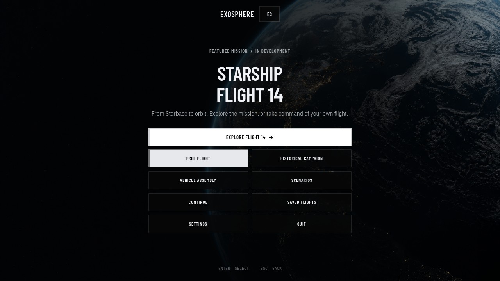
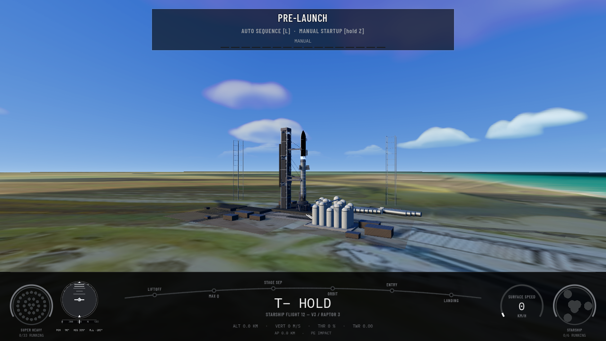
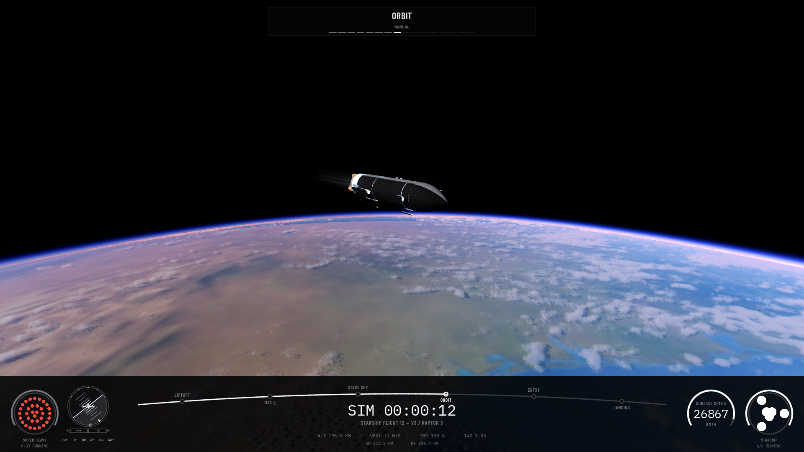
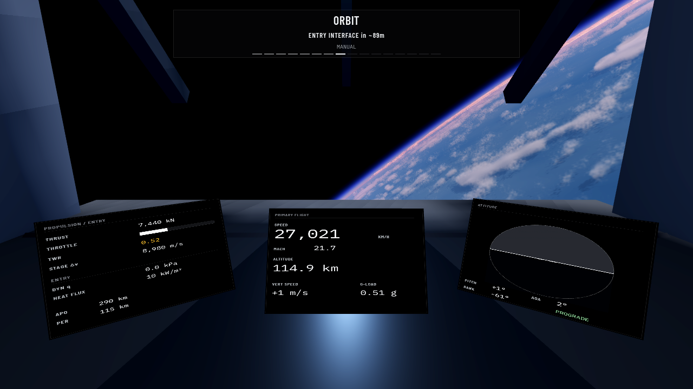
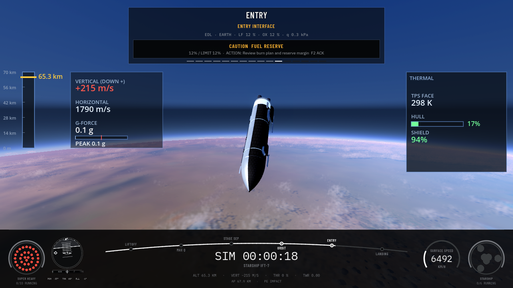
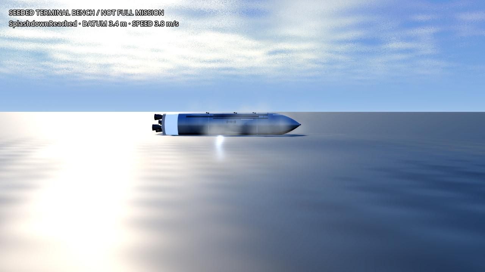
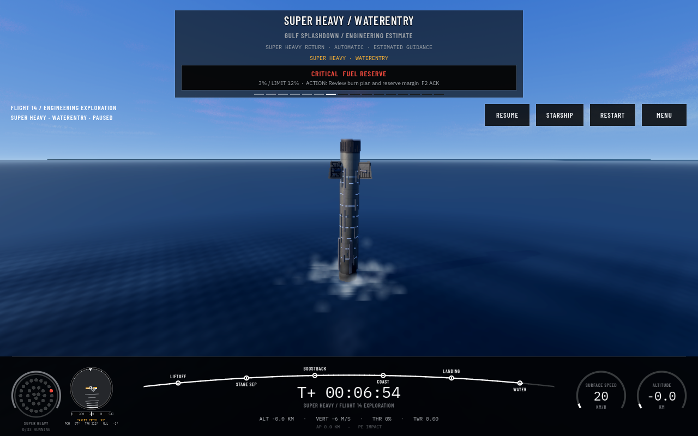

# Exosphere

Exosphere is a space-mission simulator. You fly a launch vehicle from the pad, through ascent, orbit, and reentry, in a double-precision model of the solar system. Free flight, the historical campaign, and the vehicle assembly building all use that same physics.

There is no installer yet. You play by opening the source in the Godot .NET editor.

## Screenshots

Captured on 2026-10-03, with the independent booster return updated on 2026-10-04. Prepared scenes and the water-motion bench are labelled below; this gallery is not evidence of a reconstructed full Flight 14 mission. [Capture provenance](docs/screenshots/README.md).



*Flight operations menu with direct access to Flight 14 exploration and free flight.*



*Starship Flight 12 V3 on the Starbase pad, with the current broadcast telemetry.*



*Prepared orbital Starship scene with the current Earth limb, vacuum plume and telemetry.*



*Simulator cockpit in a prepared low-orbit scene.*



*Starship descending in the prepared 70 km atmospheric-entry scenario.*



*Seeded terminal bench after ten seconds of calculated water motion. Estimated sealed-hull heeling; flooding and real capsize timing remain unmodelled.*



*Original detached Super Heavy shortly after estimated Gulf water contact, following continuous launch and return. Guidance calibration improves height and timing; this is still an engineering estimate.*

## Play

| Need | Version |
|------|---------|
| Godot with .NET support | 4.6.3 |
| .NET SDK | 8 |

The standard Godot build, without .NET, cannot open this project.

1. Clone the repository.
2. Open this folder in Godot 4.6.3 .NET and run the project. The main scene is the flight operations menu.
3. Choose **Free Flight**, select a vehicle, review its configuration and launch. Use **Historical Campaign** for mission objectives or **Scenarios** for prepared flights.

On the pad, `L` starts the countdown, hold `Z` to throttle up, and `G` flies the ascent autopilot. `F5` quicksaves and `F9` loads. **Settings** selects the graphics profile, interface language and telemetry density. Use `Tab` and `Enter` to navigate menus; `Esc` closes a briefing or selector.

Lighting follows simulation time. Warp forward to see dawn and night. The full HUD shows solar elevation.

## Controls

### Flight

| Key | Action |
|-----|--------|
| `Z` / `X` | Throttle up / down (hold) |
| `W` `S` | Pitch |
| `A` `D` | Yaw |
| `Q` `E` | Roll |
| `T` | SAS |
| `Space` | Stage |
| `G` | Ascent autopilot |
| `H` | Gravity-turn assist |
| `L` | Countdown and launch |
| `.` `,` | Warp up / down |
| `F5` `F9` | Quicksave / quickload |
| `C` | Camera presets and cockpit |
| `V` | Vehicle assembly |
| Right-drag | Orbit camera |
| Wheel | Zoom |

Warp levels are `1`, `2`, `3`, `5`, `10`, `50`, `100`, `1000`, `10000`, and `100000`. The sim clamps warp during powered flight and inside the atmosphere.

### Map

| Key | Action |
|-----|--------|
| `M` | Toggle map |
| `1`–`6` | Target Mars, Moon, Venus, Jupiter, Mercury, Saturn |
| `Enter` | Create or apply the selected maneuver |
| `Tab` | Cycle map mode |
| `[` `]` | Adjust maneuver time |
| `Shift` | Larger maneuver step |
| `Alt` | Radial adjustment |
| `Delete` | Clear maneuver |

## What you can fly

- **Free Flight** offers ten launch vehicle presets: Starship Flight 7/12, Falcon 9 standard/extended fairings, New Glenn, Mercury-Redstone, Mercury-Atlas, Titan II, and Saturn V Apollo 8/11. Each opens at a compatible home pad with manual control.
- **Explore Flight 14** opens a briefing with **Start Exploration**. It runs the current estimated loaded mission automatically from Starbase Pad 2 through insertion, 26 satellite deployments, deorbit, entry and the terminal burn. Camera, map, pause/resume, restart and time acceleration (up to x200; actual acceleration depends on CPU capacity and the per-frame work budget) remain available. The preview continues beyond its retained 100 m diagnostic through an estimated low-speed water entry in a bounded northern Pacific region, then freezes after ten seconds of coupled mass-centre translation/rotation under buoyancy and drag. This shows estimated sealed-hull heeling; exact targeting, flooding and measured capsize timing remain pending. After separation, **SUPER HEAVY** follows the independently propagated booster through estimated boostback, 11 → 5 → 3 engine landing and Gulf water contact; **STARSHIP** returns to the continuing ship. Booster observation pauses at the abstracted FTS boundary. Its protected feed inventory, targeting and event clocks remain engineering estimates; [return audit](docs/audits/flight14_booster_return_2026-10-03.md) and [guidance calibration](docs/audits/flight14_booster_calibration_2026-10-03.md) and [coast refinement](docs/audits/flight14_booster_coast_calibration_2026-10-04.md). Flight controls and quicksave/load are unavailable in this automatic preview.
- **Scenarios** includes Falcon 9 from Kennedy, New Glenn from Cape Canaveral, Starship Flight 7, Starship Flight 12, and a Starship entry from 70 km.
- **Historical Campaign** lists sixteen planned missions. Briefings show objectives, flight limits, progress and prerequisites. Playable definitions currently cover Freedom 7, Friendship 7, Gemini VIII, Apollo 8 and partial Apollo 11; the remaining entries are marked as planned.
- **Vehicle Assembly** builds a craft from the parts catalog and launches it to the pad.
- **Scenarios → Starship / 70 km entry interface** starts a belly-flop entry, with the flip and landing burn still left to fly.

Time warp, a navball, a cockpit, and an orbital map are available in flight. Transfer planning covers Hohmann planetary transfers and an Earth–Moon route.

## Graphics profiles

**Settings → Graphics Profile** saves your choice across launches. **Auto** chooses
**Integrated GPU** when Godot identifies an integrated adapter, otherwise **Quality**.
You can select either profile manually.

Integrated GPU renders the 3D world at 75% resolution per axis, disables
MSAA (FXAA on Forward+/Mobile) and reduces cloud lighting samples and
screen-space effects. Menu text and telemetry stay at native resolution; physics and simulation clocks are unchanged.
Quality restores native 3D resolution, 2× MSAA and the existing lighting effects.
Dense clouds still run slowly on the tested Ryzen 5 7530U Radeon; this preset is a
measured improvement, not a 30 FPS guarantee. See
[the target-hardware comparison](docs/audits/integrated_gpu_preset_2026-10-02.md).

For reproducible captures, `EXOSPHERE_GRAPHICS_PRESET=integrated`, `quality` or
`automatic` overrides the loaded preference without saving it. Normal launches
should leave this variable unset.

## Develop

The Flight 14 numerical diagnostic can propagate the same loaded vehicle through
launch, insertion, 26 payload releases, a single-engine deorbit and descending
entry to 90 km:

```bash
dotnet run --project tools/Flight14TrajectoryProbe/Flight14TrajectoryProbe.csproj -- \
  data /tmp/flight14-return 60 --return
python3 tools/compare_flight14_telemetry.py /tmp/flight14-return/telemetry.jsonl \
  --output /tmp/flight14-return/display-comparison.json
```

This is an engineering diagnostic, with estimated hardware and guidance. It does
not establish either controlled water return. The menu now exposes this progress as an explicitly labelled engineering exploration, rather than full mission acceptance.
See [the continuous-return audit](docs/audits/flight14_continuous_return_2026-10-02.md)
and [the conditional entry timing correction](docs/audits/flight14_entry_timing_correction_2026-10-02.md).
The probe also records [the rotating-body ground track](docs/audits/flight14_ground_track_2026-10-02.md)
at the absolute simulation epoch, with longitude tied to the simulation prime
meridian. Geographic targeting and dated Greenwich orientation remain separate work.
An additional `--descent` mode continues that same state to its first 3 km crossing:

```bash
dotnet run --project tools/Flight14TrajectoryProbe/Flight14TrajectoryProbe.csproj -- \
  data /tmp/flight14-descent 60 --descent
```

See [the aerodynamic-descent diagnostic](docs/audits/flight14_aerodynamic_descent_2026-10-02.md)
for measured loads, attitude tracking error and remaining broadcast coverage.
This endpoint does not establish flip-and-burn, powered landing or water contact.
A further `--landing` diagnostic uses the same loaded state and reserve through
an estimated three-sea-level-engine flip and terminal burn to its first 100 m
crossing. It retains physical spool, gimbal and restart behavior and adds no
header-tank refill or water-contact outcome:

```bash
dotnet run --project tools/Flight14TrajectoryProbe/Flight14TrajectoryProbe.csproj -- \
  data /tmp/flight14-terminal-final-proof 60 --landing
```

Current trim/terminal results and remaining uncertainty are documented in
[the trim and terminal-burn audit](docs/audits/flight14_trim_terminal_2026-10-02.md).
The subsequent estimated shallow-entry policy and unresolved reference residuals
are documented in [the entry control audit](docs/audits/flight14_shallow_corridor_2026-10-02.md).


Menu capture and navigation checks: `python3 tools/menu_quick_check.py` (Godot .NET and Xvfb required). The checks use isolated user data and save real-framebuffer captures in `exports/menu-operations-review/`.

Build, architecture, data, and current limits: [docs/DEVELOPMENT.md](docs/DEVELOPMENT.md).

The physics model is [docs/physics/PHYSICS_MODEL.md](docs/physics/PHYSICS_MODEL.md). The product plan is [ROADMAP.md](ROADMAP.md).

Source code is [MIT](LICENSE). Fonts, terrain, and other third-party assets keep the licenses recorded in [data/licenses/assets_manifest.json](data/licenses/assets_manifest.json).

The exterior flight HUD uses a broadcast-style bottom band: stage-aware engine
boards for every launch vehicle (and independent Super Heavy and Starship boards),
the piloting navball, an observed-event timeline,
mission clock, surface speed, altitude, vertical speed, throttle, TWR and orbital
apsides. `[F3]` cycles Minimal → Full → Clean; Full adds diagnostics and Clean
retains only the navball and critical alerts. The menu exposes this choice under
Settings → Flight Telemetry. Legacy Clean settings migrate once to the broadcast
band; explicitly choosing Clean afterwards remains persistent. Cockpit and map views use their existing
instrument policies. Loaded flights without a known liftoff epoch display `SIM`
time instead of inventing `T+`. Engine dots use catalog mount geometry and stable
runtime identities; generic boards show the current and next propulsion stage.
Mercury retro packs remain aggregate indicators, rather than invented per-motor
telemetry. Redstone uses a suborbital coast marker. Switching vessels resets the
instrument identities. `python3 tools/menu_quick_check.py --flight-hud` captures
all ten launchers and validates density/camera transitions plus mechanical staging.
