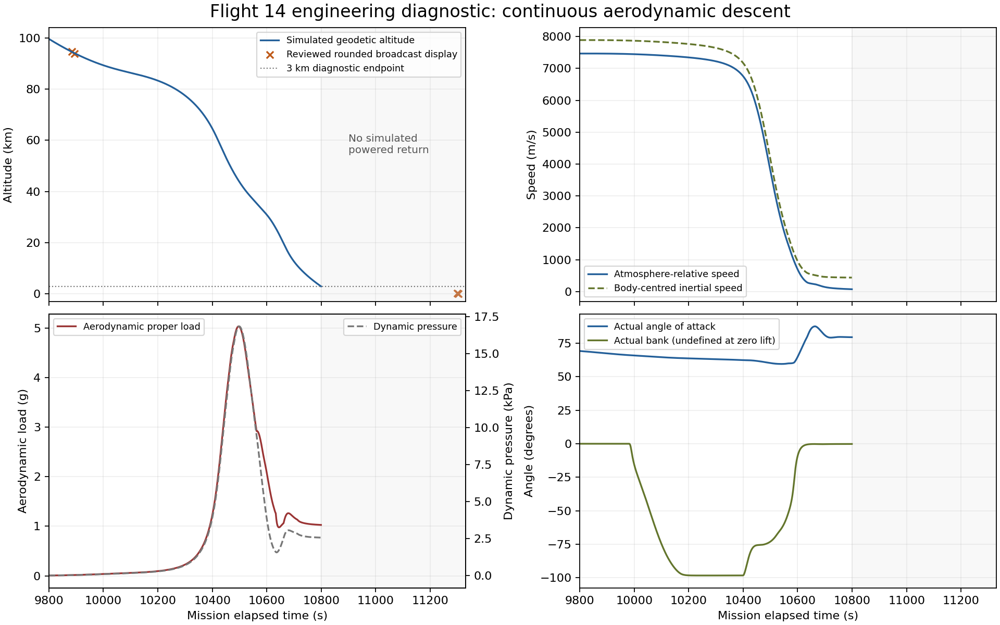

# Flight 14 continuous aerodynamic-descent diagnostic

## Scope and reference boundary

This increment continues the original loaded carrier below the previous descending
90 km witness. Launch, insertion, all 26 releases, the single sea-level deorbit,
mission clock, hardware and remaining reserve retain their existing definitions.
The new controller commands bank and attitude through the production actuator
path and stops at the first descending 3 km crossing. This is a diagnostic handoff,
not a flip, powered landing, water-contact or complete mission acceptance gate.

The [official Flight 14 post-flight account](https://www.spacex.com/launches/starship-flight-14%20)
identifies the early northern Pacific return, one sea-level deorbit engine and
three sea-level engines for the ship's landing flip. It does not publish the bank
schedule, flap commands, atmosphere, exact vehicle mass or return coordinates.
The new guidance profile is explicitly an engineering estimate. It must not be
presented as the flown SpaceX control law.

The manually reviewed broadcast anchors remain read-only comparison evidence.
The reviewed late images at T+11300 and T+11304 show rounded 0.3/0.2 km and
203/60 km/h respectively; those points belong to the powered-return domain, below
this diagnostic. Matching shallow-entry anchors does not establish agreement
with that terminal sequence.

## Control and physical boundaries

`Flight14DescentController` wraps the existing return controller until its 90 km
endpoint. It then retains the same vessel and universe. Guidance uses rotating-air
velocity for drag/lift and body-centred inertial tangential speed for the local
ballistic acceleration estimate. The latter is a local approximation in the
geodetic-up frame, not an exact oblate-Earth trajectory predictor.

The existing `EntryCorridorGuidance` descent limiter selects a bank direction;
dynamic-pressure blending avoids demanding full bank before aerodynamic authority
exists. A filtered belly-first attitude reference is projected onto the chosen
angle-of-attack cone. Below the estimated 1000 m/s transition the requested angle
moves from 70 toward 90 degrees, reaching broadside at 250 m/s. These thresholds,
the 0.05 rad/s reference filter and the 3 km endpoint are estimated controls, not
observed Flight 14 data. Cone projection preserves the aerodynamic reference but
does not guarantee that the final reference changes at precisely the filter's
rate; actual vessel rotation remains actuator-driven.

The controller writes throttle/SAS/pitch-yaw-roll commands only. It does not write
position, velocity, orientation, angular velocity, propellant or temperatures.
The existing legacy force/actuator/thermal integration remains in use, including
its RCS authority floor, angular-rate envelope and simplified body/flap model.
Coupled 6-DoF is not enabled by this increment. No aerodynamic coefficient,
physical part, engine, atmosphere or thermal model is retuned for this result.

The first crossing must have downward speed, airspeed at most 150 m/s, and an
intact controlled vehicle; an invalid crossing blocks rather than continuing to
seek a later passing sample. Destruction, loss of ownership and envelope/time
failures also block. The diagnostic does not consume the retained landing fuel.
Geographic telemetry is measured from the propagated state, with the existing
epoch-zero prime-meridian convention; there is no landing-region controller yet.

## Validation

The final continuous 60 FPS run reached the first 3 km crossing:

| Propagated measurement | Value |
|---|---:|
| 90 km handoff, mission elapsed | 9981.30 s |
| 3 km witness, mission elapsed | 10799.02 s (T+02:59:59) |
| Witness geodetic altitude | 2999.634 m |
| Atmosphere-relative speed | 75.309 m/s |
| Geodetic vertical speed | -74.138 m/s |
| Remaining LF + LOX | 70120.028310 kg |
| Peak aerodynamic proper load | 5.0351 g |
| Peak dynamic pressure | 16859.46 Pa |
| Peak stagnation heat flux | 456229.94 W/m² |
| Maximum post-handoff angular rate | 0.03640 rad/s |
| Endpoint shield/airflow alignment | 0.98304 |
| Body-fixed endpoint | 23.090199° N, 178.230047° W |

Every post-handoff vertical-speed sample remained downward; the controller's
maximum climb statistic is zero. No destruction or structural control loss was
reported. The sampled maximum skin/hull temperatures were 1725.64/1713.33 K,
and sampled thermal damage remained zero. These are production-model outcomes,
not validated temperatures or loads of the real vehicle. The original reserve
remained unchanged during aerodynamic descent.

The comparison against the prior ground-track probe found all 9,994 samples
before handoff identical for every original field. Physical-data hashes are
unchanged. The same 90 km witness and shallow-entry display residuals are retained:
-34.77/+129.51 m if the unspecified broadcast altitude datum is treated as geodetic.
The 60 FPS trace samples the endpoint 20 ms after its pre-integration witness.

The deeper controller does **not** establish a match to the actual descent. Actual
AoA around the deceleration pulse is approximately 60–63° against its 70° command,
and about 79.4° at the 3 km gate against its 90° command. This exposes disturbance
tracking error in the existing attitude/actuator path; the command reference must
not be mistaken for measured vehicle attitude. Next refinement should assess
trim/authority and load/range response, preserving the physical force model.

Two additional local broadcast frames were visually reviewed during this pass:
`video_11306.jpg` displays T+03:08:10, 1.2 km and 363 km/h; `video_11310.jpg`
displays T+03:08:14, 0.8 km and 363 km/h, with three sea-level engine indicators
lit in the latter image. Camera/engine indicators establish an observed sequence,
not engine force, throttle, mass or a calibrated attitude. These lower-altitude
speeds are not covered by this 3 km diagnostic. They make terminal drag/mass and
flip timing important next checks; they do not authorize changing physical
coefficients to force agreement. The existing twelve-anchor comparison input is
unchanged.

The reviewed broadcast 300 m powered-return image is 500.98 seconds later than
this 3 km witness. These are different milestones, so that interval is not a
measured landing-time residual. The final three reviewed anchors remain outside
the simulated domain. The comparator samples 9/12 anchors and explicitly reports
that coverage is missing. No late-clock shift, altitude/fuel reset or synthetic
hover is added to make those observations line up.



The final stricter first-crossing run returned `COMPONENT_PASS`; every byte of
physical telemetry matches the initial run. It uses the same simulation assembly
as the tests (SHA-256 `b5e7a374487def9198baf8d511a3a0392738231ce69bebe67d889416dfb02f74`).
The final trace SHA-256 is
`3d404ce9c64c3ac91e6679f3e6b247eb14f4e4f62c567795f15c6d2375f3a0f7`.
Required `bash tools/ci_check.sh` completed successfully: **975 xUnit tests**,
three builds with zero warnings/errors, content/source contracts, Flight startup,
main-menu/construction headless smoke and the graphics-menu check passed. The
new continuous test guards direct changes to kinematics, resources and thermal
state during descent, requires the original tank and reserve, and verifies an
intact descending endpoint with dissipated orbital energy and shield alignment.
Validation/ownership tests reject invalid estimates, intervals and lost control.

The continuous probe and xUnit endpoint are numerical component evidence only.
The CI headless checks do not demonstrate a rendered Flight 14 mission, real
cloud/lighting agreement or physical integrated-GPU performance. No new rendered
flight or end-to-end gameplay acceptance is claimed.

## Reproduce

```bash
dotnet run --project tools/Flight14TrajectoryProbe/Flight14TrajectoryProbe.csproj -- \
  data /tmp/flight14-descent-final 60 --descent
python3 tools/compare_flight14_telemetry.py /tmp/flight14-descent-final/telemetry.jsonl \
  --output /tmp/flight14-descent-final/display-comparison.json
```

`--return` retains the original 90 km endpoint; `--descent` composes the deeper
controller. The trace now records production q, aerodynamic load, bank/AoA,
stagnation heat flux, skin/hull temperatures and thermal damage. These are
simulated quantities, not additional broadcast measurements. Full gameplay,
both controlled water returns and visual comparison on the integrated-graphics
preset remain work under the active Flight 14 goal.

The current game bridge still owns `IPhysicsStepController` and delegates controls
to `EDLController`; its render update passes frame delta to `Universe.Tick`.
It does not execute this composed diagnostic. Gameplay promotion needs explicit
mission-controller ownership and equivalent whole-step/remainder handling in
that moving-body universe. The featured Flight 14 launch remains unavailable.
The immediate numerical next step is trim/authority assessment for the observed
AoA error, followed by the three-sea-level-engine flip and controlled water return.
The booster requires its own Gulf return and engine/resource sequence; an intact
ship at 3 km cannot stand in for either recovery outcome.
