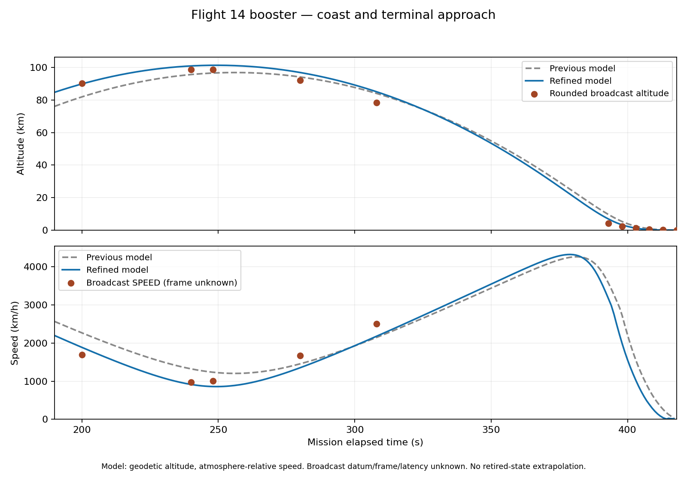

# Flight 14 booster coast and terminal presentation refinement — 2026-10-04

Status: engineering calibration; exact flown trajectory acceptance remains open.
Baseline: `d5cc7bd5e07039a8613c5f6ff14570c4e4f11810`.

## Evidence and scope

The same pad-loaded vehicle, moving Earth, inherited detached booster, engine
failures and protected 200 t landing partition remain authoritative. No stage is
reseeded, and no reference display or event clock assigns position or velocity.
Starship stays the Universe physics owner while the camera observes Super Heavy.
Gravity, global aerodynamics, engine ratings, attitude gains, landing guidance and
11 → 5 → 3 engine selection are unchanged.

Additional paused frames from the [provided mission video](https://www.youtube.com/watch?v=lw0nj_XiUoU)
were checked with decoded video time and saved screenshots. The left booster
instruments at T+200, +240 and +280 supplement the retained T+248 and +308 readings.
The right SPEED instrument belongs to Starship and was excluded. The engine board
at T+145 appears lit and at T+180 unlit; those frames do not establish exact engine
count, a measured cutoff instant or a three-dimensional attitude history.

Sources: [new manual anchors](../research/STARSHIP_FLIGHT14_BOOSTER_BROWSER_ANCHORS_2026-10-04.json),
[retained manual anchors](../research/STARSHIP_FLIGHT14_BOOSTER_BROWSER_ANCHORS_2026-10-03.json),
and [comparison report](../research/STARSHIP_FLIGHT14_BOOSTER_COAST_COMPARISON_2026-10-04.json).
The screenshots and decoded clocks are retained locally under
`exports/flight14-booster-coast-refinement/`. Altitude datum, speed frame, broadcast
latency and measurement uncertainty are unknown. Rounded readings are comparison
anchors, not force-model inputs or reconstruction pass criteria.

## Steering change

The former cached separation-state attitude and estimated apogee parameter are
replaced by a smooth commanded elevation sweep. Its progress is

`p = clamp(ln(m_start / m_current) / ln(m_start / m_end), 0, 1)`.

`m_end` excludes the consumable main-feed budget but includes the protected landing
partition. This is normalized ideal rocket delta-v progress, not mechanical
impulse. Real engine startup, thrust, propellant depletion and attitude response
still determine the delivered forces. Repeated control updates without physics
integration cannot advance mass, progress or the physical flight state.

The current estimate commands +89° to −78° at throttle 0.4, the hardware model's
minimum. These are explicit unmeasured calibration controls. Exhausted main feed
is checked before the sweep calculation; missing delivered boostback thrust blocks
the booster controller instead of falsely certifying a burn.

A 32-sample midpoint forecast uses variable mass, fixed ambient/rated thrust,
local constant gravity and ideal attitude to choose the horizontal bearing only.
It ignores drag and rotation in its predicted ballistic coast; the production
propagator retains existing forces and moving-body coordinates. Replacing the
forecast with actual candidate propagation is a future refinement, not a claim
that this reduced-order guidance is SpaceX's controller.

## Common-anchor comparison

Both models are compared at the same five coast clocks (200, 240, 248, 280, 308 s).
Residuals are model minus displayed reference. The comparison utility reports
atmosphere-relative and body-centred inertial speed separately; neither is assumed
to be the broadcast's frame.

| Coast display residual | Baseline RMS | Candidate RMS |
| --- | ---: | ---: |
| Geodetic altitude versus displayed altitude | 4.900 km | 3.952 km |
| Atmosphere-relative speed versus displayed speed | 369.56 km/h | 234.41 km/h |

The candidate body-centred inertial speed residual RMS is 1143.30 km/h. That
comparison alone does not identify the broadcast frame. The baseline trace lacks
that speed field and no inertial baseline is invented.

| MET | Reference altitude | Candidate geodetic altitude | Reference SPEED | Candidate atmosphere-relative speed |
| --- | ---: | ---: | ---: | ---: |
| 200 s | 90.3 km | 89.926 km | 1691 km/h | 1888.7 km/h |
| 240 s | 98.9 km | 101.006 km | 977 km/h | 915.5 km/h |
| 248 s | 98.8 km | 101.408 km | 1010 km/h | 860.0 km/h |
| 280 s | 92.2 km | 96.966 km | 1670 km/h | 1353.6 km/h |
| 308 s | 78.5 km | 85.134 km | 2510 km/h | 2179.5 km/h |

Aggregate improvement does not mean every residual improved. Late coast remains
too high, particularly T+280 and +308. Contact also occurs earlier than the
reference's rounded near-zero altitude at T+418. The candidate has retired at
T+417.38, so that final anchor is explicitly **missing**, never extrapolated from
a non-propagated wreck. Terminal comparisons must use shared clocks; comparing
six baseline samples with five candidate samples as if identical is invalid.
At the five shared terminal clocks (393, 398, 403, 408, 413 s), altitude residual RMS
is 2.811 km for the baseline and 1.269 km for the candidate. This remains a display
comparison, with the same unknown datum/latency caveats.



The plot uses the same saved trace inputs and manual readings as the comparison
report. Its local generator is retained as `exports/flight14-booster-coast-refinement/plot-comparison.py`.
It stops each curve at recorded samples and does not extrapolate the retired stage.

## Continuous numerical witness

The diagnostic reaches a sampled apogee around 101.4 km. Physical main-feed LOX
exhaustion ends boostback at T+182.38 with the protected 200 t intact. Landing arms
at T+393.98 around 5.992 km and −821 m/s geodetic vertical speed. Cluster changes
request 5 engines at T+407.54 and 3 at T+411.82; these request clocks are not the
instant of delivered thrust after startup/spooldown.

Water contact is recorded at T+414.36: geodetic altitude 1.637 m, vertical velocity
−2.442 m/s, surface speed 2.608 m/s. FTS retirement follows at T+417.38, altitude
−7.119 m and surface speed 5.302 m/s. The upward vertical velocity there is the
already enabled bounded buoyancy response, not a renewed landing climb. Explosive
energy, fragments, flooding, physical waves and measured FTS delay remain absent.
The preview's post-step frame clocks can be 20 ms later than these pre-step witnesses.

## Terminal HUD correction

A real-framebuffer FTS capture exposed a false ~0.2 km altitude jump: the booster
had stopped propagation while Earth advanced through another 20 ms step. Reading
the wreck's old inertial position against the new Earth position created a false
altitude and orbital state. The numerical diagnostic already used the immutable
termination witness correctly.

The HUD now captures the controller's terminal witness for this retired observed
booster. Altitude, surface/vertical speed and witness epoch remain recorded;
thrust is zero, and force, aerodynamic, direction and orbit diagnostics are
unavailable rather than fabricated zeros. The screen renders unavailable values
as dashes, cockpit attitude geometry is suppressed when undefined, and the navball
stops sampling destroyed vessels. Switching observation to Starship restores live capture. No body or
vessel state is moved to repair a presentation error.

## Validation and remaining work

A seven-frame real Godot sequence runs the continuous pad-to-booster-water path
with the IntegratedGpu profile, software OpenGL Compatibility, Xvfb and native
1280 × 800 UI. All frames were decoded and visually inspected. There are no script
or shader errors in the completed console log. `06-fts.png` displays the preserved
−7.119 m / 5.302 m/s state and an unavailable navball; `07-starship-continues.png`
shows the continuing powered ship at the same post-step T+417.40 frame boundary.

The selected-cluster captures are not instantaneous delivered-count witnesses:
`03-landing-11.png` is an ignition request during startup (0 running), and
`04-landing-3.png` requests three while five still deliver during spooldown.
Continuous integration checks delivery of all three counts independently.
The published [booster image](../screenshots/booster-return.png) is the water
observation frame at T+414.78, after shutdown completes, not the exact contact
instant. Source and image hashes, helper backups and logs remain locally in
`exports/flight14-booster-coast-refinement/`; all temporary helpers were removed
and `project.godot` was not modified. The other six gallery images retain their
2026-10-03 source provenance.

Final `bash tools/ci_check.sh` exited 0: all three builds completed with
0 warnings / 0 errors; all 1053 xUnit tests passed (0 failed, 0 skipped; 25 m 6 s),
including continuous original-booster return, live ship orbital continuity,
reserved-feed conservation, control-without-integration, exhausted-feed rejection
and terminal witness presentation. The new comparison utility's five Python
regressions passed alongside existing data/source contracts. Flight startup,
headless main/construction smoke and the real-framebuffer graphics menu check
also passed. The completed local log is
`exports/flight14-booster-coast-refinement/ci.log`; the earlier interrupted run is
retained separately as `ci-before-terminal-hud-fix.log` and is not counted as a pass.

The saved-model comparison can be reproduced without changing game state:

```bash
dotnet run --project tools/Flight14TrajectoryProbe/Flight14TrajectoryProbe.csproj -- \
  data /tmp/flight14-booster-coast --booster
python3 tools/compare_flight14_booster.py \
  --telemetry /tmp/flight14-booster-coast/booster-telemetry.jsonl \
  --anchors docs/research/STARSHIP_FLIGHT14_BOOSTER_BROWSER_ANCHORS_2026-10-03.json \
    docs/research/STARSHIP_FLIGHT14_BOOSTER_BROWSER_ANCHORS_2026-10-04.json \
  --output /tmp/flight14-booster-coast/display-comparison.json
```

Next calibration should jointly constrain separation velocity, main-feed cutoff,
mid-coast altitude/speed and landing timing, with more source-backed attitude and
inventory evidence. The inherited hardware model, reserve, Gulf target and speed
frame remain uncertainties. Near-water spray, distant ocean appearance, cloud
spacing and abstracted FTS visuals remain visible limitations. Returning the
camera to Starship can show an empty left booster engine board; that fleet-board
retention issue remains separate from the corrected retired-state telemetry.
Generic fuel/dynamic-pressure alarms also retain their existing vehicle-wide
thresholds; they are not evidence of a flight-specific SpaceX alert policy.
