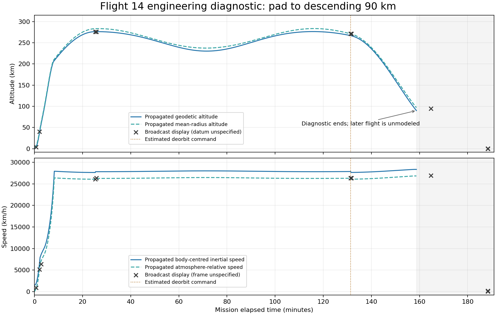

# Flight 14 continuous deorbit and entry diagnostic

Date: 2026-10-02. Scope: the same loaded pad fixture now propagates through
ascent, insertion, 26 payload deployments, early deorbit and descending entry to
90 km. This extends the [payload diagnostic](flight14_payload_deployment_2026-10-01.md).
It is not a playable Flight 14 mission or controlled water-return acceptance.

## Source and estimate boundary

[SpaceX's postflight report](https://www.spacex.com/launches/starship-flight-14%20)
describes an early return in the northern Pacific, with a single sea-level Raptor
for deorbit. Its planned long timeline is not the flown early-return clock.
The pinned [broadcast observations](../research/STARSHIP_FLIGHT14_OBSERVED_ANCHORS_2026-10-01.json)
retain the separate early-deorbit observation window and the later entry display.
Speed frame and altitude datum remain unspecified by the broadcast.

`starship_flight14_return_estimate.json` labels its commands and bounds as
engineering estimates. T+7884 s is an earliest command input from the observed
window, not an independently established ignition time. The 60 km osculating
periapsis target, 120 s alignment lead, 0.04 rad/s deorbit command-reference slew,
0.025 rad/s entry reference slew and nominal lift-up 70 degree angle of attack
are estimates. Shutdown lag and propagated state determine the actual response.
The fixture retains the Flight 12 V3 hardware baseline and 2 t satellite estimate.
No physical coefficients or resources were retuned to force a broadcast match.

## Physical sequencing

`Flight14ReturnController` wraps the existing loaded launch/payload controller.
After the last release it retains the same tank, vessel and Universe, commands
unpowered coast and gradually prepares the retrograde turn. It calls the existing
single-engine burn component, which checks engine health, pointing, angular
settling and delivered thrust before periapsis-based completion. An engine-off
command does not count as shutdown: the controller waits for residual thrust
before turning the TPS windward. The reserve floor is checked before and during
the burn.

Commands affect throttle, engine selection, SAS and actuator input. They never
assign physical position, velocity, orientation or angular velocity. No state is
reseeded at insertion, deployment, deorbit or entry. The original tank is not
refilled; all 26 detached satellites remain independently propagated vessels.

Entry uses the shared belly-first attitude reference and a bounded reference
slew. Witnesses are recorded from the real descending state at 120 km and 90 km,
with geodetic and mean-radius altitudes, both speed frames, geodetic vertical
speed, central-body specific energy, tank contents and windward shield alignment.
The 90 km endpoint is a diagnostic handoff, not entry completion or splashdown.

The inherited model uses whole 20 ms committed steps with retained render-frame
remainder, isolated Earth at epoch zero, production oblate gravity/J2/atmosphere
for the carrier, and central-body Kepler propagation for the detached payloads.
The existing uncoupled actuator path and idealized RCS authority are retained;
RCS propellant consumption is not modeled. The coupled solver remains disabled.
There is no dated terrestrial frame, Pacific targeting or controlled booster return.

## Reproduce

```bash
dotnet run --project tools/Flight14TrajectoryProbe/Flight14TrajectoryProbe.csproj -- \
  data /tmp/flight14-return 60 --return
python3 tools/compare_flight14_telemetry.py /tmp/flight14-return/telemetry.jsonl \
  --output /tmp/flight14-return/display-comparison.json
bash tools/ci_check.sh
```

Omitting `--return` preserves the prior deployment-plus-60-second-tail diagnostic.
The extended summary records the return profile and assembly hashes and explicitly
retains `diagnosticOnly: true`, `missionAcceptance: false`,
`returnRegionTargeted: false` and both controlled recoveries as false.

## Verification and reference comparison

The initial abrupt retrograde reference produced a peak angular rate of
0.157848 rad/s and failed the probe's 0.15 rad/s envelope. Slewing only the
command reference reduced the peak to 0.040105 rad/s; there is no physical-state
rate clamp. The original ascent/deployment guard remains 0.05 rad/s.

The final 60 FPS run records:

| Measurement | Result |
| --- | --- |
| Payload deployments / post-deployment carrier mass | 26 / 193721.82 kg |
| Post-deployment and pre-deorbit propellant | 72721.82 kg, unchanged during coast |
| Deorbit command / periapsis target / delivered shutdown | T+7884.00 / 7888.34 / 7888.58 s |
| Maximum delivered deorbit engines | 1 sea-level engine |
| Propellant after shutdown / consumed | 69356.39 / 3365.43 kg |
| Central-body specific energy before / after shutdown | -30.02664 / -30.49843 MJ/kg |
| Osculating periapsis altitude after shutdown | 54.371 km above mean body radius |
| Descending 120 km interface | T+9289.50 s, -137.05 m/s vertical |
| Descending 90 km diagnostic endpoint | T+9522.28 s, -116.54 m/s vertical |
| Endpoint inertial / atmosphere-relative speed | 7877.99 / 7456.37 m/s |
| Windward TPS dot velocity at 120 / 90 km | 0.94423 / 0.91572 |
| Whole-run maximum angular rate | 0.040105 rad/s |
| Pre-return maximum angular rate | 0.034757 rad/s |

`tools/ci_check.sh` passed with **953 xUnit tests**, zero build warnings/errors,
source/tool contracts, flight startup checks, Godot menu/construction smokes and
graphics preference checks. The new continuous tests run at 30 and 120 FPS and
verify physical-state immutability of return commands, unchanged coast reserve,
actual one-engine thrust/propellant/energy response, descending altitude gates,
TPS windward alignment and the return angular-rate envelope. They also reject
ownership changes and an invalid return estimate. The separate final 60 FPS
probe returned `COMPONENT_PASS`, with identical recorded trajectory values.

The comparator samples 7 of 11 pinned video anchors. T+9884 s and the three
landing anchors are outside coverage; none is treated as passing or extrapolated.
Selected **same-clock** residuals (simulator minus broadcast) are:

| T+ (s) | Geodetic altitude (m) | Mean-radius altitude (m) | Air-relative speed (m/s) | Inertial speed (m/s) |
| ---: | ---: | ---: | ---: | ---: |
| 124 | -3977.2 | -921.0 | -41.9 | +353.4 |
| 1519 | +181.8 | +7207.9 | +19.9 | +453.5 |
| 7884 | -4160.8 | +91.5 | -18.8 | +416.2 |
| 7904 | -4602.9 | -435.6 | -79.7 | +355.3 |

The geodetic 94.6 km descending sample occurs at approximately T+9484 s;
the broadcast displays 94.6 km at T+9884 s. That is approximately **400 s early
under the geodetic-altitude interpretation**, far beyond clock alignment uncertainty.
This is an event-level discrepancy, not a valid same-clock comparator match.
The differing altitude/speed residuals are kept separate; apparent agreement
cannot resolve the unspecified broadcast datum or speed frame.



Evidence from `/tmp/flight14-return-verified/`:

- Telemetry SHA-256: `9a8a9a190e8f1c89845f5c771e6ea2089981fc84ce74239a2d6af91853c80cfb`.
- Physics assembly SHA-256: `36c42cde218ab8589f4e4c4bde3fd32353ea6e98ace530550e2fb839131f0404`.
- Return estimate SHA-256: `7e90bbc198ef0e38fb0d1c267765ffb32b83d418d7d2a7ba2c77824efaa1e798`.
- Pinned observations SHA-256: `ae56f2ff94832ec5db35d97dc7a9ac30315474c1281945fd6d226d3e763cc7cb`.

The raw telemetry is a local artifact; the figure and numerical witnesses above
are retained in the repository.

## Remaining mission work

Resolve the entry timing discrepancy using the observed return arc and explicit
uncertainty in orbit, mass, deorbit impulse and atmospheric model. Then implement
dated moving-body gameplay/warp integration, geographic targeting, deeper entry
thermal/control gates and terminal flip/burn/water outcomes. The Flight 14 menu
action remains unavailable until its own continuous playable mission is verified.
