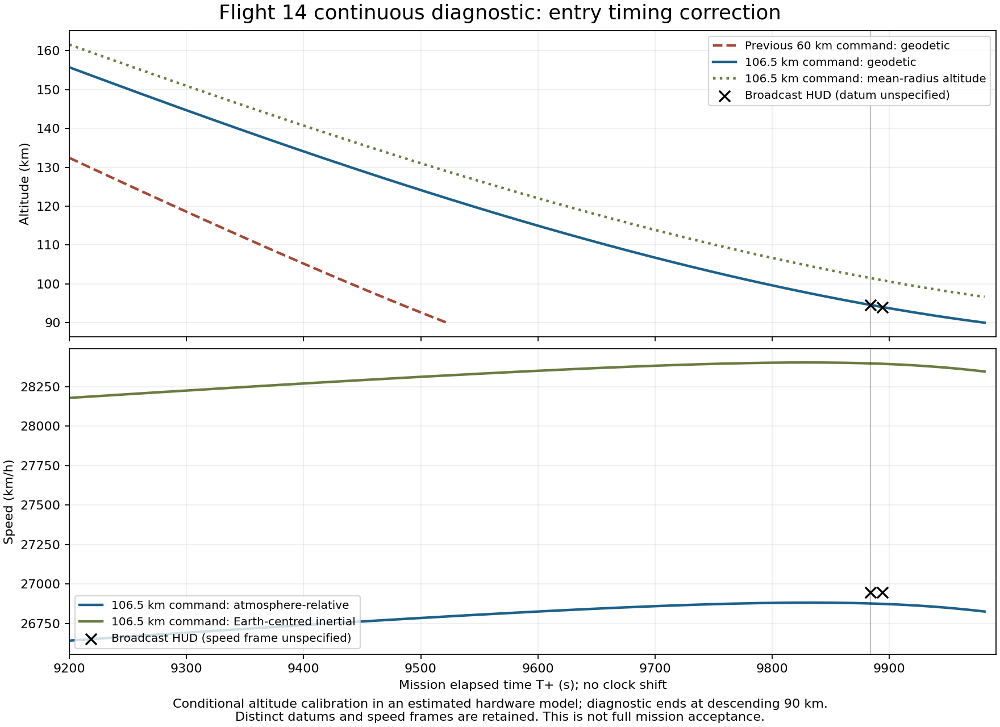

# Flight 14 entry timing correction

Date: 2026-10-02. Baseline revision: `85dfa80`. Scope: correct the continuous
engineering diagnostic's early entry while retaining the original loaded state,
resources, production force models and mission clock. This does not complete
Pacific targeting, controlled splashdown or the playable mission adapter.

## Evidence and cause

The [previous diagnostic](flight14_continuous_return_2026-10-02.md) commanded a
60 km osculating periapsis above mean body radius. Delivered shutdown overshot
to 54.371 km. Its descending geodetic 94.6 km sample occurred at T+9484 s,
400 seconds before the [pinned broadcast observation](../research/STARSHIP_FLIGHT14_OBSERVED_ANCHORS_2026-10-01.json)
at T+9884 s; it descended at approximately 122 m/s there. That command was an
engineering assumption, not a measured Flight 14 burn target. The discrepancy
is in the estimated return guidance, not evidence of gravity disappearing.

The adjacent video frame at video time 9910 s was inspected separately. It shows
T+02:44:54, 93.9 km and 26947 km/h, ten seconds after 94.6 km and the same displayed
speed at T+02:44:44. This suggests approximately 70 m/s descent over that interval.
Rounded altitude, integer clock quantization and unknown feed latency limit this
estimate. The additional frame is pinned by SHA-256
`bc5ffc0c9472cd6370f7d272c101d75e5b8143683a1f2bed3223cc7ddb40661c`.
The reviewed reference now contains 12 anchors; prior audit counts/hashes remain
historical evidence for their recorded revision.

The [SpaceX postflight account](https://www.spacex.com/launches/starship-flight-14%20)
establishes a single sea-level Raptor deorbit and northern Pacific return.
It does not supply the flown periapsis command used by this model. The original
long planned timeline is not substituted for the observed early-return clock.

## Correction

The radial periapsis command and the geodetic diagnostic endpoint are distinct
quantities. Validation previously required the command to be below the geodetic
90 km endpoint, unnecessarily excluding shallow targets. They now have separate
bounds: an explicitly estimated 110 km mean-radius command ceiling and unchanged
120/90 km geodetic entry/endpoint gates. Physical propagation and the existing
mission timeout still decide whether descending entry is actually reached.

The new 106.5 km mean-radius command is calibrated within the existing model
under an explicitly **conditional geodetic interpretation of the displayed
altitude**. The followup observation checks interval consistency. This is not a
measured flown periapsis, a unique inverse solution or an established broadcast
datum. Both altitude datums and both speed frames remain separate in comparisons.

All candidate runs start with the same loaded pad fixture and carry the same
26 satellites through insertion, deployment and the early deorbit coast. The
controller still commands the real single-engine burn and waits for delivered
shutdown. It never consumes the display anchors as force targets, overwrites
physical state, refills fuel or shifts the mission clock. Drag/lift coefficients,
Earth/atmosphere data, estimated masses, earliest deorbit command, attitude
policy and physics solver are unchanged. The coupled solver remains disabled.
Against the baseline run, all 156 physical-data hashes, launch/payload profile
hashes, initial mass, cutoff/insertion clocks and release conservation witnesses
are identical. Independently created satellite UUIDs naturally differ between runs.

The sweep measured a roughly 1.06 km difference in delivered periapsis for a
single 20 ms difference in commanded burn duration near the selected target.
The 106.5 km command selects the shorter physical burn; there is no instant
velocity correction or special entry delay.

## Continuous sweep and final results

Nearest real descending geodetic samples are used below, without interpolation.
Each candidate completed the physical component gates; a component pass alone
does not establish reference agreement.

| Command above mean radius (km) | Delivered periapsis (km) | Nearest 94.6 km T+ (s) | Event offset from T+9884 (s) | Vertical speed there (m/s) |
| ---: | ---: | ---: | ---: | ---: |
| 60, baseline | 54.371 | 9484 | -400 | -122.23 |
| 85 | 78.802 | 9648 | -236 | -92.16 |
| 95 | 89.423 | 9747 | -137 | -75.58 |
| 97.5 | 91.547 | 9770 | -114 | -71.87 |
| 105 | 98.979 | 9867 | -17 | -56.83 |
| 106.5, selected | 100.040 | 9883 | -1 | -54.43 |

The final 60 FPS run reached `COMPONENT_PASS`, retaining the original tank and
26 released vessels. The deorbit command occurred at T+7884.00 s; the target was
crossed at T+7887.48 s and delivered thrust finished at T+7887.72 s. Propellant
decreased from 72721.82 to 70120.03 kg, and specific orbital energy decreased
from -30.02664 to -30.39098 MJ/kg. Maximum return angular rate was 0.04011 rad/s.
The windward shield alignment cosine remained 0.944 at the 120 km interface
and 0.914 at the 90 km endpoint.

The descending 120 km gate occurred at T+9544.02 s; the descending 90 km
endpoint occurred at T+9981.30 s with vertical speed -39.14 m/s. The nearest
sample to geodetic 94.6 km was 94619.59 m at T+9883 s, one second before the
reference. This is a nearest 1 Hz sample, not a subsecond event-time claim.

At the unchanged reference times, the comparison reports:

| Reference T+ (s) | Geodetic altitude residual (m) | Mean-radius altitude residual (m) | Atmosphere-relative speed residual (m/s) | Inertial speed residual (m/s) |
| ---: | ---: | ---: | ---: | ---: |
| 9884 | -34.77 | +6882.10 | -19.29 | +402.72 |
| 9894 | +129.51 | +7023.35 | -19.97 | +402.01 |

Simulated geodetic descent over this ten-second interval averages 53.57 m/s,
compared with approximately 70 m/s inferred from the rounded display. The
remaining interval residual is retained; the model is not fitted exactly to
both readings. Sample clock offsets are below 0.001 s. This does not eliminate
the reference's one-second alignment uncertainty or unknown feed latency.

The comparator covers 9/12 reviewed anchors. The three terminal landing/contact
anchors remain missing because the diagnostic ends at 90 km. Ascent and deorbit
residuals remain visible: for example, geodetic altitude is 3977 m below the
T+124 s display and 4161 m below the T+7884 s display. The latter mean-radius
residual is only +91 m, which reinforces that a datum cannot be chosen as fact
from this limited reference. Coverage alone is not a passing match.



## Regression checks and reproduction

The continuous 30/120 FPS tests retain the same-tank/coast-reserve, no-reseeding,
single-engine thrust, reduced energy/propellant, descending entry and windward TPS
checks. They additionally compare the two entry observations at their unchanged
mission times under the conditional geodetic assumption, allowing 500 m residual
and an interval descent envelope of 40–110 m/s. These engineering tolerances are
not assertions about actual broadcast measurement accuracy. A data-contract test
accepts a radial target above the geodetic endpoint, and rejects a target above
the independent radial command ceiling.

Validation completed successfully:

- Final 60 FPS continuous probe: `COMPONENT_PASS`, 26 releases, one deorbit
  engine, descending 120/90 km witnesses, no recovery or mission acceptance claim.
- Full `tools/ci_check.sh`: exit 0; 954 xUnit tests passed, zero failed/skipped,
  including the continuous return/reference checks at 30 and 120 FPS.
- All three .NET builds: zero warnings and errors.
- Telemetry comparator: 9 Python tests passed; 9/12 reference anchors covered
  by the final run, with the three terminal observations explicitly missing.
- Flight startup, main/construction headless Godot smoke and the graphics menu
  check passed. These do not establish gameplay or visual Flight 14 acceptance.
- Final before/after figure inspected; `git diff --check` passed.

```bash
dotnet run --project tools/Flight14TrajectoryProbe/Flight14TrajectoryProbe.csproj -- \
  data /tmp/flight14-entry-corrected 60 --return
python3 tools/compare_flight14_telemetry.py \
  /tmp/flight14-entry-corrected/telemetry.jsonl \
  --output /tmp/flight14-entry-corrected/display-comparison.json
bash tools/ci_check.sh
```

Evidence hashes for this run:

| Artifact | SHA-256 |
| --- | --- |
| Telemetry JSONL | `b7c2f98b78e9a9c1fbecab7716bc2660a77ff81497b88be21a4927ea67c4d92a` |
| Physics assembly | `3e47d6706de78a77950e15d970b76d7fc256b5245ff388d44e5571a3db3ea883` |
| Return estimate JSON | `416d4f76417e61190c650e798a216e49f4b912d68aa629ea4237bacd2f3322ce` |
| Reviewed display anchors JSON | `32c53a4a0da7400b960479ca0b45fc13ad7270a9341629f4cb8e793eefdf8998` |

Raw run artifacts were written to `/tmp/flight14-entry-corrected/`; the probe
summary also records the physical-data hashes, loaded hardware, mission clock,
release witnesses and explicit `missionAcceptance: false` status. The commands
above regenerate this evidence; temporary run files are not repository assets.

## Remaining limits

This calibrates entry timing within the isolated-Earth, epoch-zero engineering
fixture and its estimated hardware/attitude/RCS model. It does not establish the
actual inertial state or trajectory, the broadcast datum/speed frame, dated Earth
orientation or a geographical return solution. The diagnostic ends at descending
90 km; deeper thermal/control behavior, Pacific targeting, flip/landing burn and
water outcomes still require continuous gameplay validation.
