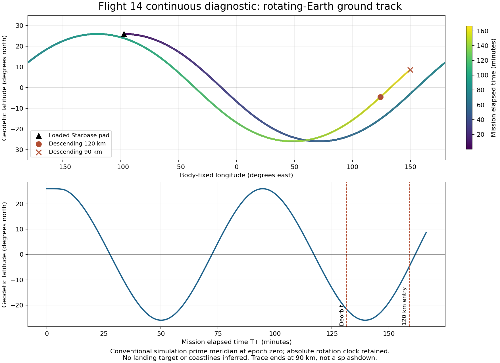

# Flight 14 rotating-body ground-track diagnostic

Date: 2026-10-02. Starting revision: `79116f8`.

## Purpose and reference limits

The corrected continuous return diagnostic already reaches descending 90 km,
but altitude and speed agreement do not establish a geographic return. This
increment records the propagated ground track before adding geographic guidance
or declaring a controlled splashdown.

The [SpaceX postflight account](https://www.spacex.com/launches/starship-flight-14%20)
identifies the early return region as the northern Pacific and the booster return
as an offshore Gulf splashdown. It does not supply exact landing coordinates in
that account. Both coordinates and their uncertainty remain unknowns in
`starship_flight14_2026.json`. The original planned Chile-adjacent target is not
substituted for the observed early return.

## Coordinate and clock contract

`CelestialBody.GetGeodeticCoordinatesAtTime` inverts the existing timed surface
position mapping. It subtracts the body's current inertial position, rotates the
relative vector backwards around the spin axis at the **absolute simulation
clock**, and resolves ellipsoidal latitude, longitude and height. Mission elapsed
time is separately measured from liftoff and must not replace that rotation clock.
Longitude is normalized to [-180, 180] degrees; pole longitude is conventional.

The longitude datum is the simulation's conventional prime meridian at epoch
zero, anchored consistently with its launch-site mapping. The current fixture
still uses isolated Earth at epoch zero, rather than a dated Greenwich sidereal
phase, solar geometry or a real reconstructed orbit. A geographic trace in this
frame is an engineering diagnostic, not a measured Flight 14 trajectory.

The probe writes `simulationTimeSeconds`, `bodyFixedLatitudeDegrees` and
`bodyFixedLongitudeDegrees` alongside existing mission-clock, speed and altitude
fields. Both descending entry witnesses record those coordinates and their
absolute epoch. The summary explicitly declares the geographic frame and
retains `returnRegionTargeted: false` and `missionAcceptance: false`.

This is read-only observation. No controller target, command, force, atmosphere,
resource, kinematic state or original telemetry field is adjusted to obtain
these coordinates. The 90 km endpoint remains the limit of this diagnostic.

## Validation and measured ground track

The final 60 FPS run completed `COMPONENT_PASS`. All 9,995 original telemetry
samples match the previous entry-corrected run exactly for every pre-existing
field, including altitude, both speeds, phase, angular rate, energy, fuel and
clock. The additional coordinate observations do not change the trajectory.
The telemetry comparator still covers 9/12 reference anchors; terminal landing
observations remain outside the 90 km diagnostic scope.

| Witness | Mission T+ (s) | Absolute simulation time (s) | Latitude (degrees north) | Longitude (degrees east) |
| --- | ---: | ---: | ---: | ---: |
| Loaded pad, first post-liftoff sample | 0.02 | 2.86 | 25.997600 | -97.157300 |
| Deorbit-window sample | 7884.00 | 7886.84 | -21.627671 | 14.934928 |
| Descending 120 km interface | 9544.02 | 9546.86 | -4.489351 | 124.121008 |
| First reviewed entry-clock sample | 9884.00 | 9886.84 | 5.847206 | 144.068431 |
| Descending 90 km witness | 9981.30 | 9984.14 | 8.723008 | 149.873517 |

The last witness is north of the equator at western-Pacific longitudes in this
simulation convention. The interface was still south of the equator, and the
ship crossed it during entry. Neither witness is a landing footprint or an ocean
contact: the ship still travels at approximately 7.45 km/s relative to the air at
90 km. No exact real-world return coordinates, ground-track agreement or water
outcome are inferred from these observations. The reviewed broadcast tracker is
qualitative geography, not a source of calibrated latitude/longitude readings.

Liftoff occurs at simulation time 2.84 s in this fixture. Using mission elapsed
time as the rotation epoch would introduce a longitude error even though both
clocks show the same interval duration. The witness regression explicitly checks
the clock difference and reconstructs the final witness position, allowing only
the physical displacement of the last 20 ms integration step.



Validation passed:

- Ten focused coordinate tests cover translated centers, an oblate Earth,
  negative and long epochs, retrograde Venus, the Moon, date-line wrapping,
  polar latitude/height and non-finite epoch rejection. The quarter-day test
  independently expects an inertially fixed equatorial point to move 90 degrees
  west in the rotating-Earth frame.
- Full `tools/ci_check.sh`: exit 0; 964 xUnit tests passed, zero failed/skipped,
  including continuous pad-to-entry tests at 30 and 120 FPS with geographic
  witness/epoch consistency and final-position reconstruction checks.
- All three .NET builds completed with zero warnings/errors.
- Final 60 FPS probe: `COMPONENT_PASS`, 26 deployments and unchanged physical
  entry witnesses. Comparison of all original fields in all 9,995 telemetry
  samples found no changes against the entry-corrected baseline.
- The telemetry comparator's nine Python tests passed; final reference coverage
  remains 9/12, with all three terminal observations explicitly missing.
- Flight startup, main/construction Godot headless smoke and graphics-menu checks
  passed. No full playable Flight 14 or rendered flight acceptance is claimed.
- The standalone ground-track figure was inspected; `git diff --check` passed.

## Reproduction

```bash
dotnet run --project tools/Flight14TrajectoryProbe/Flight14TrajectoryProbe.csproj -- \
  data /tmp/flight14-groundtrack 60 --return
bash tools/ci_check.sh
```

The probe summary records assembly and physical-data hashes. Raw JSONL and
summary output are temporary run artifacts under `/tmp/flight14-groundtrack/`;
the commands above regenerate them.

| Artifact | SHA-256 |
| --- | --- |
| Telemetry JSONL | `0aa4906fe51157d2adfdf0677d44f7531501c192d6eecd27373ab61b2867a43c` |
| Run summary JSON | `bb5724f76e59decda73ee4d83ae21d85bcf527cf844126d0710d060e2d6a9d2e` |
| Physics assembly | `a7d891fd74fcbf23dba3521cb866f0deb6e2fc1e4355b6815238c9757c8dc82e` |

Guidance, payload, return estimate and physical-data hashes are unchanged from
the entry-corrected run. Independent satellite UUIDs vary between runs; release
conservation witnesses and all original telemetry fields remain unchanged.

## Next work under the active Flight 14 goal

Extend the same propagated ship below 90 km through thermal/attitude control,
belly-flop, flip, terminal burn and water contact. Define any estimated return
corridor separately from source-backed region information, and assess miss and
water outcome from the actual propagated state. Reconstruct the booster's Gulf
return with its own engine/resource sequence. Integrate the resulting mission
into gameplay with a consistent fixed-step driver and moving-body frame, then
verify end-to-end gameplay and visual captures on the integrated-graphics preset.
