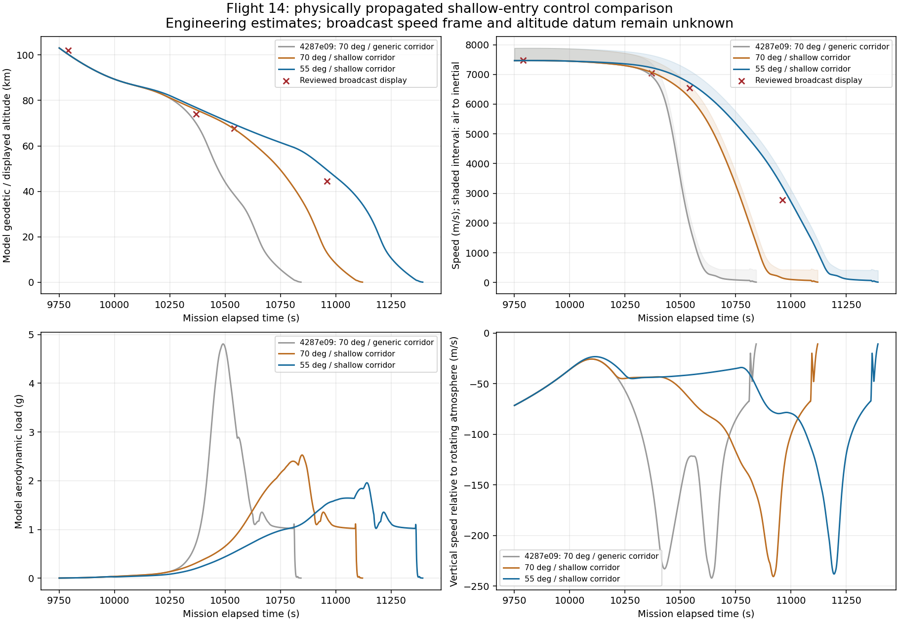

# Flight 14 shallow-entry control investigation

## Status and scope

This continues the `4287e09` loaded-pad-to-terminal diagnostic. It does not enable
or establish the featured playable mission, water contact, geographic targeting,
booster recovery or full reconstruction acceptance. Both continuous candidates completed. Full repository verification passed: 988 xUnit tests,
all three builds with zero warnings/errors, startup smoke and menu graphics checks;
measurements below are labelled by run.

The unchanged production force model is used throughout. No vehicle mass, inertia,
engine performance, atmospheric density, aerodynamic coefficient, thermal state,
vehicle position/velocity, fuel quantity or mission clock is rewritten to match
the broadcast. The generic EDL/catch descent defaults remain 100 m/s minimum,
0.035 airspeed fraction, 20 s response and 150 m/s deadband.

## Hypotheses and controls

At `4287e09`, the generic hypersonic bank ceiling requested approximately 261 m/s
downward at 7450 m/s airspeed. It reached much denser air prematurely: at the
reviewed T+02:55:41 display (67.8 km, 23567 km/h), the model was at 38.46 km and
1941.61 m/s atmosphere-relative speed. The display frame/datum are unresolved,
but neither modeled rotation nor altitude-datum differences explain this gap.

Candidate 1 passes an explicit Flight 14 engineering policy to the shared bank
calculation: `-max(20 m/s, 0.006*airspeed)` with a 20 s response and 30 m/s
range-command deadband. The policy changes the requested lift direction only.
Physical attitude response, flap travel, gravity, centrifugal effects, aerodynamic
lift/drag and thermal evolution remain owned by the integrator. Generic callers
retain their prior defaults. Candidate 1 keeps the former estimated 70° AoA.

Candidate 1 reaches 67.39 km and 6226.82 m/s at T+02:55:41, while still preserving
entry reserve and completing the physical terminal burn. However, at T+03:02:41
it is already at 12.88 km and 148.34 m/s, compared to the display's 44.5 km and
9982 km/h. From about T+10541 the actual bank is nearly zero, so further bank
feedback cannot supply additional lift-up authority. This identifies an important
model/control limitation rather than proving a broadcast match.

Candidate 2 tests an estimated 55° hypersonic AoA with the same shallow policy.
In the existing hypersonic polar, `CL = 0.7*sin(2*AoA)` and
`CD = 1.5 - 0.9*cos(AoA)^2`, giving L/D about 0.323 at 70° and 0.546 at 55°.
The vehicle must physically rotate to the new request; its pose is never assigned.
These coefficients and angle are simulator approximations, not measured Flight 14
flight commands. The initial angle below the 90 km handoff remains governed by
the existing return controller. Low-speed guidance still transitions to 90°.
A constant-wind bench verifies the physical static trim/servo at 55° within 1°.

The new positive finite policy fields are validated on profile load. Regression
coverage checks degraded/healthy flap trim and verifies that a shallower requested
corridor retains lift magnitude and bank side while the generic defaults are
unchanged. Complete loaded-state tests also check control-only writes, original
fuel continuity and actual engine delivery/start budgets.

## Reference provenance

The browser-display manifest now also records an additional validation capture:
T+02:52:49, 74.1 km, 25369 km/h. Its paused media-element time is 10384.814714 s,
separate from the visually read HUD clock. This point was not used to select the
0.006 policy fraction or the 55° candidate. It is comparison evidence, not an
independent flight-data measurement. The complete browser page and source title
are retained in `video_10384.jpg`; SHA-256:
`d53fe6faf1f99ec5cd8cb31b42e7b250a66858491210797505011e826f07ffd7`.

The [user-provided video](https://www.youtube.com/watch?v=lw0nj_XiUoU)
is the broadcast relay used for all four visually transcribed descent displays.
The stream's served encoding is not authenticated by the older local video-file
hash. Each image is separately hashed, and 2 s alignment uncertainty plus unknown
speed frame, altitude datum, display rounding and transmission delay remain explicit.
The official SpaceX page returned no readable body in the current web check; no
newly verified proprietary aerodynamic or flap-command data were obtained from it.

## Continuous candidate 2 evidence

The loaded-pad `--landing` run exited 0 with `COMPONENT_PASS`. All 9994 samples
through T+9981.3 s exactly match `4287e09`. All body, physical part, vehicle,
launch-site, engine and engine-cluster hashes are unchanged. The same original
reserve remains 70120.03 kg through unpowered descent; 26 satellites were released
by the same carrier before deorbit. No control callback imposes physical state.

| Reviewed T+ (s) | Display altitude (km) | Candidate 2 geodetic altitude (km) | Display speed (m/s) | Airspeed (m/s) | Inertial speed (m/s) |
| --- | ---: | ---: | ---: | ---: | ---: |
| 9790 | 102.0 | 100.27 | 7482.50 | 7466.69 | 7888.95 |
| 10369 | 74.1 | 76.84 | 7046.94 | 7229.02 | 7648.43 |
| 10541 | 67.8 | 69.48 | 6546.39 | 6716.71 | 7131.85 |
| 10961 | 44.5 | 49.36 | 2772.78 | 3223.48 | 3630.25 |

The final row remains 4.86 km high and 451 m/s faster in atmosphere-relative
speed (857 m/s faster in inertial speed). Unknown broadcast frames/datum must
not be used to erase this discrepancy. The additional validation row remains
2.74 km high; visual reproduction is not established from these numbers alone.
All four new reference timestamps now lie within capture coverage. The previous
12-anchor comparator also remains separate from any force/control authority.

Flip starts physically at T+11359.38 s, 1199.89 m, descending 67.27 m/s.
The first descending 100 m witness is at T+11392.68 s and 11.27 m/s airspeed.
The burn takes 33.30 s and leaves 48082.30 kg at the pre-step witness; actual
shutdown mass flow continues through the final physics step. Three sea-level
engines delivered thrust before monotone reduction to one; starts/completed
starts are 4/4, 2/2, 2/2 with no failure code. Post-handoff maximum climb rate is
zero, maximum unpowered angular rate is 0.050002 rad/s, aerodynamic peaks are
1.959 g, 6.113 kPa and 267.977 kW/m². The 0.35 rad/s powered legacy envelope
remains unchanged; no six-degree-of-freedom parity is claimed.

Compared at approximately the same rounded 1.2 km display, the flip is now
69.38 s late rather than 480.80 s early. This is a large improvement, not exact
clock reconstruction or splashdown acceptance. The final incidental coordinates
are 28.426° N, 150.806° W; no guidance target, official landing coordinates,
ocean material classification or water-contact witness is established by them.
Mission acceptance and both controlled recovery flags remain false.

Evidence SHA-256:

- Physics assembly: `65a7b707602198cd2b67bc97c365c10eeeeea6a681b0afc07b0b650c1bd4f8a8`
- Probe summary: `732b114448119ff3d3d67972ec95d1c946261074fef3e3ff211585e13909d49a`
- Probe telemetry: `bf8f441a723fa6895f9ce35f0825686f8bbdc28143405e93e48f9e0fed74b36e`
- Applied descent profile: `845e308ec6f2604d6ba10fbf78917ad83a547d7ccfb93b3e6a46628e0f293998`
- Final descent profile: `61648d92ed285fb9010b7811ac64f11cc9b8c09c09be3176fba9906bfa0457c2`

After capture, one descriptive assumption was corrected from the former 70° to
55°. No numeric control field changed. The run's applied profile is preserved
in `/tmp/flight14-shallow-candidate2/applied-descent-profile.json`; its hash above
is kept distinct from the final metadata correction. Aggregate builds/tests
validate the final source and numeric profile; a future run can regenerate the
trace with the updated description without claiming that the two file hashes match.



## Reproduce

```bash
dotnet run --project tools/Flight14TrajectoryProbe/Flight14TrajectoryProbe.csproj -- \
  data /tmp/flight14-shallow-candidate2 60 --landing
python3 tools/compare_flight14_telemetry.py /tmp/flight14-shallow-candidate2/telemetry.jsonl \
  --anchors docs/research/STARSHIP_FLIGHT14_DESCENT_BROWSER_ANCHORS_2026-10-02.json \
  --output /tmp/flight14-shallow-candidate2/browser-comparison.json
```

## Remaining acceptance work

Return timing, energy/range corridor, possible real skip behavior, actual mission
attitude commands and hardware parameters remain uncertain. Geography needs a
defined estimated target and closed-loop footprint evidence, rather than labelling
an incidental diagnostic endpoint as a successful Pacific return. Physical hull
contact, water outcomes and the independent Gulf booster sequence remain absent.
Gameplay ownership, moving-body/frame cadence and integrated-graphics rendered
mission captures still require verification before the featured button can be enabled.
