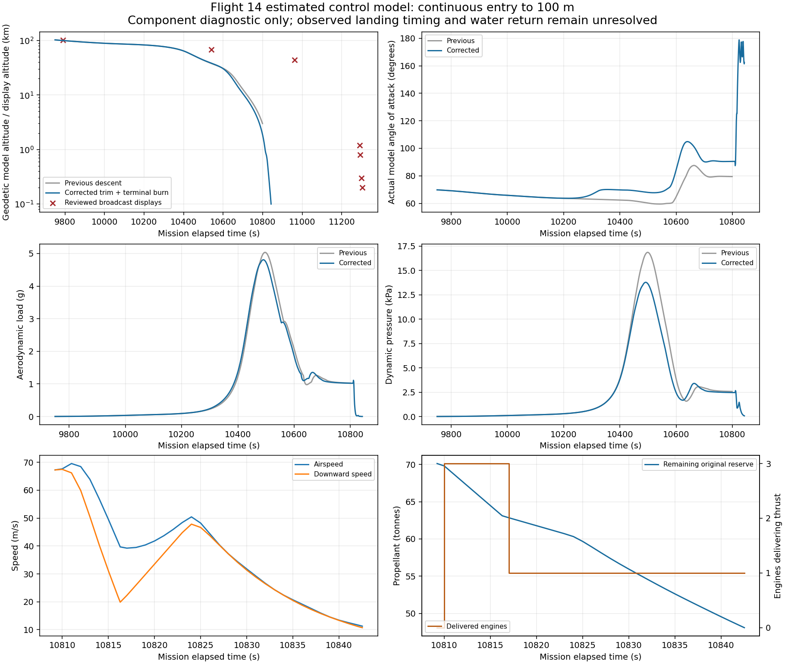

# Flight 14 aerodynamic trim and continuous terminal-burn diagnostic

## Scope

This increment addresses the measured static attitude offset in the previous
continuous descent, and extends the original loaded ship into a three-sea-level
engine flip and terminal burn. No kinematic or fuel state is reseeded between
launch, insertion, the 26 releases, deorbit, entry and powered descent.
The first descending 100 m crossing is an engineering diagnostic endpoint.
It does not establish water contact, geographic targeting or full mission acceptance.

The [official Flight 14 postflight account](https://www.spacex.com/launches/starship-flight-14%20)
reports the three-sea-level-engine landing flip and northern Pacific return. The
existing reviewed local frames show 1.2 km/363 km/h at T+03:08:10, 0.8 km/363 km/h
with three sea-level indicators lit at T+03:08:14, and 0.3 km/203 km/h at T+03:08:20.
Frame hashes (SHA-256): `video_11306.jpg` is
`dd544fc76e9affa4fb4aa3b364b1387b7b4c68202ccb5efd9d794f19c0d92eda`;
`video_11310.jpg` is
`939bcb90175b1bc6408c4b2332feedc4b1732df597dbe6cd037c9085062ef5ec`.
The source track and manual video-clock alignment remain pinned in the reviewed
reference manifest. Those displays constrain sequence and comparisons; they do not disclose mass,
engine throttle, flap commands or a calibrated vehicle attitude.

## Controls and model boundaries

The original proportional/rate feedback needed a persistent attitude error to
balance the production model's aerodynamic centre moment. In the previous run,
actual AoA was around 60–63° against a 70° reference and about 79.4° against a
90° reference at 3 km.

`Flight14AerodynamicAttitude` computes the same static aerodynamic angular
acceleration that the existing legacy attitude integration uses. It converts that
moment into a bounded flap bias using the existing flap authority and the current
control-health factor. The legacy integration scales the flap request before
advancing its servo, so the factor is included once in this inverse calculation.
A flap-only degraded-control regression verifies that convention. Estimated 250–1000 Pa blending keeps this compensation
out of low-q entry. Rate damping remains feedback; the legacy idealized RCS floor
is not inverted. The physical flap servos and production moments still determine
motion. No aerodynamic coefficient, inertia, CP offset, flap rate or thermal
parameter changes. This is an estimated model-based control law, not SpaceX data.

`--descent` retains its first 3 km endpoint. `--landing` uses the separate landing
profile's estimated 1.2 km flip altitude as the aerodynamic controller endpoint,
then transfers control on that same physical step to `Flight14LandingBurn`.
Both profile hashes are recorded; the 1.2 km handoff is a control-configuration
override derived from the landing profile, never an imposed vehicle state.

The powered controller starts three healthy sea-level Raptors while commanding a
physical axis-pointing flip. It tracks a descent-speed profile with gravity
feed-forward and bounded lateral tilt. Engine selection decreases monotonically
from three to two/one as thrust demand falls. It does not synthesize throttle
below the minimum, cycle engines to imitate low thrust, substitute vacuum
engines for failed centre mounts, or reset restart/thermal states. Engine spool,
gimbal servos, per-mount torque and mass flow remain in force. The generic
engine runtime currently counts start attempts but does not enforce its declared
`RestartLimit`. This module explicitly checks `1 + RestartLimit` against actual
counters before ignition and throughout the burn; a depleted budget blocks. Demand can exceed available thrust; no force is imposed to satisfy it.

The continuous original reserve supplies this burn through existing main-tank
routing. Header tanks and slosh are not newly represented. The 100 m endpoint
cuts the command and stops the diagnostic; residual shutdown thrust is physical,
and a continued unpowered fall from that endpoint is not a controlled splashdown.
The endpoint witness is sampled before the next 20 ms physics step; the final
tank quantity may be lower by that step's physical shutdown consumption. Tests
bound this difference by the pre-step mass flow, rather than equating two epochs.
The game bridge/featured launch remains unchanged pending the complete mission.

## Verification

The constant-wind actuator benches hold the 70° entry and 90° broadside references
within 1° after settling through the real flap servo and angular integration.
Measured errors are 0.038° at 70°/8,215.9 Pa and 0.210° at 90°/2,909.6 Pa.
The engine-failed, flap-only broadside bench settles at 0.189° without changing
physical flap coefficients or bypassing its reduced servo command.
These are isolated actuator tests, not mission-reconstruction acceptance.
A seeded terminal-control bench completes the finite-spool/gimbal flip, reaches
100 m descending below 15 m/s, consumes original tank fuel and reduces the cluster
to one engine. A failed centre engine blocks rather than selecting a vacuum Raptor. An exhausted
start budget blocks before issuing ignition, without resetting any engine counter.
The angular-rate comparison allows 1e-9 rad/s numerical roundoff around the existing
0.35 rad/s legacy envelope; it does not increase physical control authority.

`bash tools/ci_check.sh` exited successfully: 982 xUnit tests, all three builds
with zero warnings/errors, Flight startup smoke and menu/graphics checks passed.
These startup checks do not establish rendered mission acceptance.

The final `--landing` probe exited 0 with `COMPONENT_PASS`. It uses the original
loaded-pad fixture and fixed 20 ms physical steps throughout:

| Witness | Mission elapsed (s) | Geodetic altitude (m) | Atmosphere-relative speed (m/s) | Original reserve (kg) |
| --- | ---: | ---: | ---: | ---: |
| Aerodynamic handoff | 9981.30 | 89999.67 | 7451.84 | 70120.03 |
| Powered flip start | 10809.20 | 1198.68 | 67.26 | 70120.03 |
| First descending terminal crossing | 10842.50 | 99.83 | 11.27 | 48089.41 |

The powered interval lasts 33.30 s and consumes 22030.62 kg before its terminal
witness. The final post-step sample retains 48079.52 kg; this additional 9.88 kg
is the shutdown consumption described above. Three actual sea-level engines
deliver thrust during the flip and selection subsequently reduces to one.
Their cumulative start attempts/completed starts are 4/4, 2/2 and 2/2, within
the catalog's initial-start-plus-three-restarts limit. No failure code is present.

Post-90-km aerodynamic peaks are 4.807 g, 13.782 kPa and 408.493 kW/m².
Maximum climb rate in both the aerodynamic and powered segments is zero.
The maximum pre-landing angular rate is 0.050002 rad/s; the powered flip reaches
the existing 0.35 rad/s legacy envelope. Actual angle of attack can still lag a
moving reference even though the static trim benches settle accurately.
No full six-degree-of-freedom or water-response acceptance is claimed.

All 9994 telemetry samples through T+9981.3 s exactly match the previous
`54778cd` continuous diagnostic. Every physical body/engine/part/vehicle/launch-site
catalog hash recorded by the probe also matches that revision. Only estimated
control profiles are changed. The reviewed display comparator covers 9/12
previous anchors and 2/3 new browser anchors; remaining timestamps are explicitly
outside this diagnostic's coverage.

At approximately the same displayed 1.2 km altitude, the model reaches the flip
about 481 s before the reviewed T+03:08:10 frame. Different altitude datums and
rounded displays prevent an exact crossing comparison, but this is a substantial
unresolved return-timing disagreement. `missionAcceptance`, `returnRegionTargeted`,
`waterContactEstablished`, `controlledShipRecovery`, `controlledBoosterRecovery`
and `headerTanksRepresented` remain false.



Final evidence SHA-256:

- Physics assembly: `bfd45aad38ec78a1f2d5c9edbb8e9eb6ea53f0da7eee4c274fc927fc76d0d1ae`
- Descent profile: `d24b4b33f539e9e07089b6954b0f583c2aec63f769e2870b44df20766a61d393`
- Landing profile: `4e103581f70391d977fd73b56283cbbe12dc56ded65b0eb26c9b5681d942137e`
- Final probe summary: `5633bac7f9c70056204ee072e4759c1449929944e33630bc3a8b91a85e691acc`
- Final telemetry JSONL: `3e6b194be3f4246852015040304d864641d9d75d6dc8fb2858e98f1225d07928`

## Mid-descent source audit and next control investigation

Three additional paused browser captures are registered separately in
`docs/research/STARSHIP_FLIGHT14_DESCENT_BROWSER_ANCHORS_2026-10-02.json`.
Their individual HUD clocks were read visually; the browser's media-element time
was recorded separately. They are a separately served encoding, so the old local
video-file hash is deliberately not reused to authenticate them. Frame hashes,
capture method, rounded displays and unknown speed/altitude frames are retained.

| Observed T+ (s) | Display altitude (km) | Display speed (km/h) | Model comparison |
| --- | ---: | ---: | --- |
| 9790 | 102 | 26937 | Same-clock model near 100.27 km, 7466.69 m/s atmosphere-relative; datum remains uncertain |
| 10541 | 67.8 | 23567 | Same-clock model near 38.46 km, 1941.61 m/s atmosphere-relative (2285.57 m/s inertial) |
| 10961 | 44.5 | 9982 | Outside the 100 m diagnostic's time coverage; never substitute the last sample |

The large middle-row disagreement is present before the powered landing phase,
and cannot be explained by display rounding or by the modeled rotation offset.
The current shared `LimitLiftForDescent` policy requests
`-max(100 m/s, 0.035*airspeed)` with a 20 s response horizon. At 7450 m/s this
means about 261 m/s downward. That generic estimated descent corridor is a
specific candidate for the premature deep entry. It has not been established
as the unique cause, and no SpaceX bank/angle commands are inferred from the
onboard camera. The next Flight 14 control experiment must evaluate a shallower
estimated bank/lift corridor against these independently clock-read observations, without moving
the mission clock or altering forces to force a fit. Existing generic EDL/catch
behavior must retain its own policy.

## Reproduce

```bash
dotnet run --project tools/Flight14TrajectoryProbe/Flight14TrajectoryProbe.csproj -- \
  data /tmp/flight14-terminal-final-proof 60 --landing
python3 tools/compare_flight14_telemetry.py /tmp/flight14-terminal-final-proof/telemetry.jsonl \
  --output /tmp/flight14-terminal-final-proof/display-comparison.json
python3 tools/compare_flight14_telemetry.py /tmp/flight14-terminal-final-proof/telemetry.jsonl \
  --anchors docs/research/STARSHIP_FLIGHT14_DESCENT_BROWSER_ANCHORS_2026-10-02.json \
  --output /tmp/flight14-terminal-final-proof/browser-display-comparison.json
```

Remaining work includes deep-descent timing/range comparison, a defined estimated
Pacific landing corridor, physical water-contact geometry/outcomes, the booster's
independent Gulf return, moving-body/fixed-step gameplay integration and rendered
end-to-end validation on the integrated-graphics preset. Numerical component
passes do not enable or close the featured Flight 14 mission.

## Next water-return acceptance boundary

The generic `Universe.HandleSurfaceImpact` evaluates the vessel datum below the
reference ellipsoid, uses a speed threshold and then anchors the state to the
surface. It neither identifies ocean material nor samples the lowest physical
hull point. That existing approximation cannot establish Flight 14 splashdown.
A subsequent return stage must keep the burn continuous through a hull-geometry
contact witness, measure point-relative velocity including rotational motion,
identify the estimated Pacific water region and distinguish controlled contact
from an uncontrolled impact. Any hydrodynamic/float response must be separately
declared and validated; terminal-burn success does not imply it.
